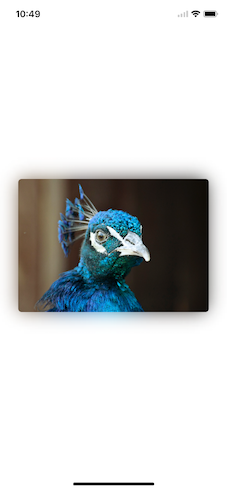

# YQShadowImageView

 

A apple music cover picture shadow style image library

It is the Objective-C version of [ShadowImageView](https://github.com/olddonkey/ShadowImageView).
Thanks to [olddonkey](https://github.com/olddonkey).

## Renderings

## Features

- [x] Auto resizing based on content mode.
- [x] Easy to change paramenters including offset, radius, alpha etc.
- [x] Storyboard(Nib) support.

## Requirements

- iOS 8.0+

## License

ShadowImageView is released under the MIT license. See LICENSE for details.

